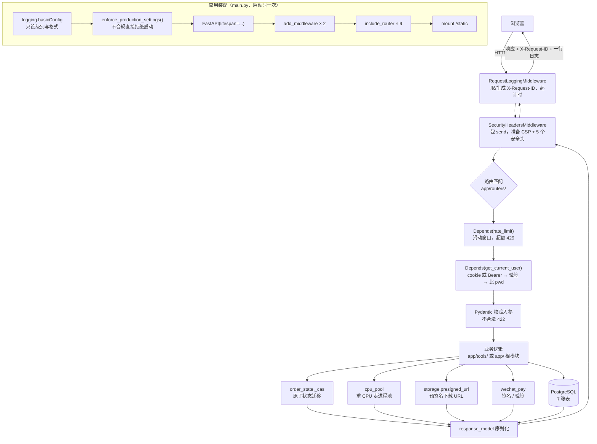

# 项目总览

> 本文是**文档体系的入口**（第一阶段产出，第三阶段整合）。
> 各子模块的详细说明书见文末「子模块索引表格」；核心类与入口函数的直达锚点见下方「快速导航」。

---

## 0. 快速导航

### 0.1 按「我想干什么」找入口

| 我想…… | 直接去 |
| --- | --- |
| 看懂一次请求怎么从浏览器走到数据库 | [§5 全局数据流向图](#5-全局数据流向图) |
| 把项目跑起来 | [§6 环境与配置总览](#6-环境与配置总览install--build--run) |
| 找某个类/函数在哪份文档里 | [§0.2 核心类与入口索引](#02-核心类与入口函数索引30-条) |
| 找某个子文件夹的说明书 | [§7 子模块索引表格](#7-子模块索引表格) |
| 看目录里都有什么代码 | [§4 项目目录树](#4-项目目录树) |
| 了解技术选型 | [§2 技术栈](#2-技术栈) |
| 了解开发硬约束 | [AGENTS.md](./AGENTS.md) |
| 了解实现取舍 | [TECH_DECISIONS.md](./TECH_DECISIONS.md) |

### 0.2 核心类与入口函数索引（30 条）

> 每条都链到对应子文件夹 README 的**具体文件小节锚点**。
> 锚点由 GitHub 的标题→锚点算法程序化生成并逐个校验存在（见 §9 复核命令）。

**① 入口与横切基础设施**（`main.py` + `app/` 根）

| 核心类 / 入口 | 说明 | 详细文档 |
| --- | --- | --- |
| `app` 应用装配（入口） | FastAPI 实例、中间件、9 个 router、静态挂载 | [查看详情](./docs/ROOT_FILES.md#-文件名mainpy52-行) |
| `Settings`（38 项配置） | 全部环境变量的唯一真相 | [查看详情](./app/README.md#-文件名configpy84-行) |
| `enforce_production_settings` | 生产配置不合规就拒绝启动 | [查看详情](./app/README.md#-文件名startup_checkspy50-行) |
| `SecurityHeadersMiddleware` / `RequestLoggingMiddleware` | CSP + 5 个安全头、X-Request-ID | [查看详情](./app/README.md#-文件名middlewarepy154-行) |
| `get_current_user` / `require_admin` | 鉴权依赖（cookie 或 Bearer） | [查看详情](./app/README.md#-文件名depspy65-行) |
| `hash_password` / `create_token` | bcrypt + JWT | [查看详情](./app/README.md#-文件名securitypy71-行) |
| `Limiter`（限流） | 滑动窗口，X-Forwarded-For 默认不信任 | [查看详情](./app/README.md#-文件名ratelimitpy101-行) |
| `run_in_threadpool` / 进程池 | 重活不阻塞事件循环 | [查看详情](./app/README.md#-文件名cpu_poolpy76-行) |
| 订单状态机 `ALLOWED` | 只允许前进；CLOSED→PAID 例外 | [查看详情](./app/README.md#-文件名order_statepy98-行) |
| `presigned_url` 预签名下载 | 一次性下载双重校验 | [查看详情](./app/README.md#-文件名storagepy110-行) |
| 微信支付签名 | APIv3 签名与回调验签 | [查看详情](./app/README.md#-文件名wechat_paypy210-行) |
| ORM 模型（7 张表） | 与 full_init.sql 必须同步 | [查看详情](./app/README.md#-文件名modelspy128-行) |
| `TOOLS` / `PAGES` 站点清单 | 加工具页只改这一处 | [查看详情](./app/README.md#-文件名sitepy68-行) |

**② API 层**（`app/routers/`）

| 核心类 / 入口 | 说明 | 详细文档 |
| --- | --- | --- |
| `auth` 路由 | 登录/登出/改密码 | [查看详情](./app/routers/README.md#-文件名authpy120-行) |
| `oauth` 路由（SSO） | 授权码 + 同意页签名 | [查看详情](./app/routers/README.md#-文件名oauthpy188-行) |
| `tools` 路由 | ER 图 / 类图 / Word | [查看详情](./app/routers/README.md#-文件名toolspy73-行) |
| `diagrams` 路由 | 流程图存取 + 乐观锁 | [查看详情](./app/routers/README.md#-文件名diagramspy192-行) |
| `shop` 路由 | 下单/支付回调/下载 | [查看详情](./app/routers/README.md#-文件名shoppy324-行) |

**③ 业务逻辑层**（`app/tools/`）

| 核心类 / 入口 | 说明 | 详细文档 |
| --- | --- | --- |
| `parse_ddl` | SQL DDL 解析 | [查看详情](./app/tools/README.md#-文件名sql_ddlpy302-行) |
| `build_data_dictionary` | Word 数据字典导出 | [查看详情](./app/tools/README.md#-文件名wordpy51-行) |
| LLM 调用封装 | 超时/预算/异常映射 | [查看详情](./app/tools/README.md#-文件名llmpy105-行) |
| FAQ 融合召回 | BM25 + 向量，权重 0.6 | [查看详情](./app/tools/README.md#-文件名faqpy198-行) |
| 意图路由 | 规则层，零成本兜底 | [查看详情](./app/tools/README.md#-文件名intentpy112-行) |
| 客服三层编排 | 规则→FAQ→RAG→转人工 | [查看详情](./app/tools/README.md#-文件名supportpy202-行) |
| 爬虫与礼貌性 | robots、按域间隔、并发上限 | [查看详情](./app/tools/README.md#-文件名crawlerpy190-行) |

**④ 数据层 / 前端 / 测试 / CI**

| 核心类 / 入口 | 说明 | 详细文档 |
| --- | --- | --- |
| `layoutEr` / `renderEr` | 纯函数布局 + D3 绘制 | [查看详情](./app/static/README.md#-文件名erjs149-行) |
| `drawio.html`（最复杂前端） | postMessage + 乐观锁 + 登录态 | [查看详情](./app/templates/README.md#-文件名drawiohtml200-行-最复杂) |
| `full_init.sql`（7 表） | 建表脚本，开头 `DROP TABLE ... CASCADE` ⇒ **只对空库安全**；CI 连跑两遍验的是空库上的 schema 幂等 | [查看详情](<./database init/README.md#-文件名full_initsql115-行>) |
| `client` fixture | 每个用例一个干净的库 | [查看详情](./tests/README.md#-文件名conftestpy121-行) |
| CI 三个 job | lint / SQLite / 真 PG | [查看详情](./.github/workflows/README.md#-文件名ciyml181-行) |
---

## 1. 项目名称与一句话简介

**codemax_platform** —— 一个基于 FastAPI 的「在线工具 + 知识付费 + 单点登录」一体化平台：
把 SQL 建表语句、自然语言描述、网页 URL 三类输入，分别转成 ER 图、UML 类图、结构化知识入库，
并配套商品购买、一次性下载、OAuth 单点登录与智能客服。

---

## 2. 技术栈

### 2.1 后端

| 技术 | 版本（实测） | 用途 |
| --- | --- | --- |
| **FastAPI** | 0.104.1 | Web 框架，全部 HTTP 接口 |
| **Uvicorn** | 0.24.0.post1 | ASGI 服务器 |
| **SQLAlchemy** | 2.0.23 | ORM（异步） |
| **asyncpg** | 0.29.0 | PostgreSQL 异步驱动（应用运行时） |
| **psycopg2-binary** | 2.9.9 | PostgreSQL 驱动（建库脚本用，同步） |
| **Pydantic** | 2.5.2 | 数据校验与配置 |
| **pydantic-settings** | 2.1.0 | `.env` 配置加载 |
| **python-jose** | 3.3.0 | JWT 签发与校验 |
| **passlib + bcrypt** | 1.7.4 / 4.0.1 | 密码哈希 |
| **python-multipart** | 0.0.6 | 表单与 OAuth2 |
| **cryptography** | （随 python-jose 装） | 微信支付 APIv3 加解密 |

### 2.2 业务库

| 技术 | 版本（实测） | 用途 |
| --- | --- | --- |
| **Jinja2** | 3.1.6 | **页面 SSR**（出 HTML 外壳与 TDK） |
| **python-docx** | 1.2.0 | 导出 Word 数据字典 |
| **BeautifulSoup4** | 4.15.0 | 爬虫解析 HTML |
| **jieba** | 0.42.1 | 中文分词（FAQ 检索） |
| **httpx** | 0.25.2 | 爬虫请求 + 测试客户端 |

### 2.3 前端

**纯 Jinja2 服务端渲染 + 少量原生 JS，无构建步骤。**

- 仓库根**没有 `package.json`** —— 刻意不引入 Node / Nuxt / Next 运行时
- 图表库从 CDN 直接引入：**D3.js v7**（ER 图）、**Mermaid v11**（类图）、**Drawio embed**（流程图 iframe）
- 自研 JS 只有 2 个文件：`app/static/er.js`（149 行，ER 图绘制）与
  `app/static/auth.js`（120 行，全站共享登录态模块，S2-02-2）

### 2.4 数据库与部署

| 技术 | 用途 |
| --- | --- |
| **PostgreSQL 16** | 生产数据库（`docker-compose.yml`、CI service 容器同版本） |
| **Docker / docker-compose** | 容器化与单机部署 |
| **GitHub Actions** | CI（3 个 job：lint / SQLite / 真 PostgreSQL） |

### 2.5 测试与质量

| 技术 | 版本 | 用途 |
| --- | --- | --- |
| **pytest** | 7.4.4 | 测试框架（30 个文件 / 389 个用例） |
| **pytest-asyncio** | 0.23.6 | 异步测试（`asyncio_mode = auto`） |
| **aiosqlite** | 0.19.0 | 测试用内存 SQLite |
| **pgserver** | 0.1.4 | 可选：PyPI 打包的真 PostgreSQL，本地跑真库测试 |
| **ruff** | 0.16.5 | **唯一的 linter**（刻意不引入 mypy） |
| **node** | 仅测试期 | 真实执行前端 JS 做契约测试 |

---

---

## 3. 核心架构分层

```text
                    浏览器
                      │
   ┌──────────────────┴──────────────────┐
   │  模板层  app/templates/   7 个 HTML   │  Jinja2 SSR：HTML 外壳 + TDK
   │  静态层  app/static/      1 个 JS     │  er.js（ER 图渲染，可被 node require）
   └──────────────────┬──────────────────┘
                      │
   ┌──────────────────┴──────────────────┐
   │  API 层  app/routers/    10 个 py     │  9 个 router + __init__
   │          main.py 里注册与装配         │  中间件（安全头、请求日志）
   └──────────────────┬──────────────────┘
                      │
   ┌──────────────────┴──────────────────┐
   │  业务逻辑层  app/tools/   11 个 py    │  DDL 解析、Word 导出、爬虫、
   │                                       │  LLM、意图路由、FAQ 检索
   └──────────────────┬──────────────────┘
                      │
   ┌──────────────────┴──────────────────┐
   │  数据层  app/models.py + database.py  │  ORM（7 张表）
   │          database init/  6 个 SQL     │  建表脚本 + 5 个迁移
   └─────────────────────────────────────┘

   横切：app/config.py（38 项配置）、security.py、ratelimit.py、
        cpu_pool.py（重活走进程池，不阻塞事件循环）、middleware.py
```

| 层 | 目录 | 规模 | 职责 |
| --- | --- | --- | --- |
| **模板层** | `app/templates/` | 7 个 HTML | SSR 出页面外壳与 TDK；图表交给客户端渲染 |
| **静态资源层** | `app/static/` | 1 个 JS | ER 图渲染（D3） |
| **API 层** | `app/routers/` + `main.py` | 10 个 py | 路由、鉴权、限流、异常映射 |
| **业务逻辑层** | `app/tools/` | 11 个 py | 全部业务算法，**不碰 HTTP** |
| **数据层** | `app/models.py` + `database init/` | 1 py + 6 sql | ORM 与建表脚本，**必须双向同步** |
| **横切基础设施** | `app/` 根 | 16 个 py | 配置、安全、限流、进程池、中间件 |
| **测试层** | `tests/` | 32 个 py | 389 个用例，跑 SQLite 与真 PG 两种后端 |
| **构建与 CI** | 根目录 + `.github/` | 5 个文件 | Docker、compose、ruff、pytest、CI |

---

---

## 4. 项目目录树

标记说明：

- **★** = 含任务指定后缀（`.py` `.json` `.html` `.js` `.css` `.yaml` `.xml`）的文件夹
- **·** = 含**其它**代码后缀（`.yml` `.mjs` `.sql` `.toml` `.ini`）的文件夹
- 括号内为该后缀的文件数
- 已排除 `__pycache__` `.git` `.venv` `.pytest_cache` `.ruff_cache` `node_modules`

```text
codemax_platform/            ★ .py（1）   · .ini .toml .yml（3）
├── .claude/                              Agent Skills（7 个 SKILL.md，无代码文件）
│   └── skills/
│       ├── codemax-workflow/
│       ├── fastapi-python/
│       ├── finish-subitem/
│       ├── new-tool-page/
│       ├── pre-commit-review/
│       ├── python-testing/
│       └── schema-sync/
├── .github/
│   └── workflows/           · .yml（1）   CI 流水线
├── app/                     ★ .py（16）   根级基础设施
│   ├── routers/             ★ .py（10）   API 层
│   ├── static/              ★ .js（1）    静态资源层
│   ├── templates/           ★ .html（7）  模板层
│   └── tools/               ★ .py（11）   业务逻辑层
├── database init/           ★ .py（1）    建库建表 + 迁移
│                            · .sql（6）
├── docs/                                 部署 / Windows / 架构讲解等文档
├── scripts/                 ★ .py（1）   文档站构建
│                            · .mjs（1）   建表脚本深度体检
└── tests/                   ★ .py（32）   测试
```

**统计（程序扫描所得，非人工清点）**：

| 项 | 数 |
| --- | --- |
| 含 ★（任务指定后缀）的文件夹 | **8** |
| 含任意代码文件的文件夹 | **10** |
| 代码文件总数 | **91** |

> ⚠️ **任务给的后缀清单有一个盲点，实测会漏掉 2 个真有代码的文件夹**：
> 清单里写的是 `.yaml` 与 `.js`，但本项目的 CI 用 **`.yml`**（`.github/workflows/ci.yml`）、
> 体检脚本用 **`.mjs`**（`scripts/check_schema_pg.mjs`，ESM 模块，用了顶层 await）。
> 严格按字面扫只会得到 8 个文件夹；按「实际代码文件」扫是 **10 个**。
> **本表与索引表都按 10 个算**，并单独标出 · 那一类，避免后人以为这两个目录没有代码。

---

---

## 5. 全局数据流向图

### 5.1 一次请求的完整链路（Mermaid）



**顺序有讲究**：限流在鉴权**之前**（`dependencies=[...]` 先于函数参数里的 `Depends`），
所以未登录的刷量请求也会被限流挡住，不会白跑一次数据库查询。

### 5.2 同一条链路的文字缩进版

```text
应用启动（只一次）
  ├─ main.py:16-19   logging.basicConfig          只设级别与格式，不动 uvicorn 的 handler
  ├─ main.py:22      enforce_production_settings  不合规直接拒绝启动
  ├─ main.py:30      FastAPI(lifespan=...)
  ├─ main.py:34-35   add_middleware × 2           后加先执行（洋葱模型）
  ├─ main.py:37-45   include_router × 9
  └─ main.py:48-52   mount /static

请求进来
  ├─ RequestLoggingMiddleware    middleware.py:128   取/生成 X-Request-ID；L131 起计时
  ├─ SecurityHeadersMiddleware   middleware.py:80    包 send，准备安全头 + HSTS
  │
  ├─ 路由匹配（app/routers/）
  │    ├─ dependencies=[Depends(rate_limit(...))]    先限流 → 超额 429 + Retry-After
  │    ├─ Depends(get_current_user) / require_admin  再鉴权 → cookie 或 Bearer
  │    └─ Pydantic 模型校验入参                       不合法 422
  │
  ├─ 业务逻辑（app/tools/ 或 app/ 根模块；routers 层不写业务）
  │    ├─ 订单迁移   order_state.py:92    _cas 原子更新
  │    ├─ 重 CPU     cpu_pool.py:50       进程池，坏了退化线程池
  │    ├─ 存储       storage.py:90        presigned_url 预签名（L98 是后端工厂）
  │    └─ 微信支付   wechat_pay.py:132    签名 → 下单
  │
  ├─ except 链 → HTTP 状态码映射                  routers 层最有信息量的部分
  │
  └─ 响应出去
       ├─ SecurityHeadersMiddleware   setdefault 5 个安全头（+HSTS）
       └─ RequestLoggingMiddleware    写回 X-Request-ID、记一行日志（异常也记）

应用退出
  └─ main.py:27   cpu_pool.shutdown()   回收子进程，否则留孤儿进程
```

### 5.3 三条典型业务链（各层的分工）

**A 链：SQL → ER 图 → Word**

```text
浏览器 er.html
  ├─ POST /tools/er-diagram ──► routers/tools.py:23-36
  │                                └─ run_in_threadpool(parse_ddl, ddl)   tools/sql_ddl.py
  │                                     └─ 返回 {tables, edges}
  │     ◄── JSON ──────────────────────────────────────────────────────
  └─ renderEr("#er-canvas", data)   static/er.js:75
       └─ layoutEr()  纯函数算坐标 → D3 画 SVG

  ├─ POST /tools/word-export ─► routers/tools.py ─► tools/word.py
  │     ◄── .docx blob ────────────────────────────────────────────────
  └─ createObjectURL → <a download> → revokeObjectURL   er.html:63-68
```

**B 链：下单 → 支付 → 一次性下载**

```text
POST /shop/orders ──► routers/shop.py ─► 建订单（PENDING）
POST /shop/pay    ──► wechat_pay.py:132  签名 → 微信下单 → 返回 code_url
                      （mock 模式走 templates/mock_pay.html + /shop/mock-pay/confirm）

微信回调 POST /shop/wechat-notify
  ├─ 平台证书验签 + AES-GCM 解密        wechat_pay.py
  ├─ order_state.mark_paid              CLOSED→PAID 也放行（TD-156 收钱必发货）
  └─ 幂等：同一通知来两遍只生效一次

POST /shop/download
  ├─ 校验订单状态 + 一次性消费          order_state._cas（并发只有一个赢）
  └─ storage.presigned_url → 预签名 URL   篡改/过期都拒
```

**C 链：SSO 跨平台登录**

```text
平台 A ──► GET /oauth/authorize ──► 未登录？→ 401
                                   已登录 → 渲染 templates/oauth_consent.html
                                            （含 HMAC 签名 sig，绑定本次 POST）
用户点「同意」
  └─ POST /oauth/authorize（带 sig + approve）
       ├─ 验签（没有 SECRET_KEY 就签不出来）
       └─ 302 → redirect_uri?code=...
平台 A ──► POST /oauth/token（code + client_secret）
            └─ code 一次性；跨 client 串用会被拒
```

---

## 6. 环境与配置总览（Install → Build → Run）

### 6.1 三个配置文件各自的职责

| 文件 | 职责 | 关键事实 |
| --- | --- | --- |
| **`requirements.txt`** | **25 个依赖，全部钉死版本** | 分四段：运行时 19 / 测试 4 / 文档工具 1 / 静态检查 1。**`requirements-dev.txt` 不存在** —— 一条命令装齐（取舍见 TD-202） |
| **`package.json`** | — | **本仓库没有这个文件**：前端是纯 Jinja2 SSR + CDN 引图表库，**无 Node 构建步骤** |
| **`docker-compose.yml`** | 单机部署（app + db 两服务） | `depends_on.condition: service_healthy`；`DB_HOST: db`（容器网络里用服务名）；`TRUST_PROXY_HEADERS: "true"` |
| `Dockerfile` | 应用镜像 | `python:3.11-slim`（**必须 3.11**：`pgserver` 无 3.13 发行版）；非 root 运行；exec 形式 CMD |
| `.env.example` | **38 项配置模板** | 与 `app/config.py` 的 `Settings` **1:1 对应**（对称差为空） |
| `ruff.toml` / `pytest.ini` | 质量工具配置 | ruff 是唯一 linter；pytest `asyncio_mode = auto` |

### 6.2 Install → Build → Run（本机开发）

```bash
# ── Install ────────────────────────────────────────────────
pip install -r requirements.txt          # 25 个依赖，含测试、lint 与文档工具
cp .env.example .env                     # 然后填 DB_PASSWORD / LLM_API_KEY 等 38 项

# ── Build ──────────────────────────────────────────────────
# 本项目**没有 build 步骤**：
#   · 前端是 Jinja2 服务端渲染，无打包
#   · 图表库（D3 / Mermaid / Drawio）从 CDN 直接引入
#   · Python 不需要编译
# 唯一等价于 build 的一步是「建库建表」：
cd "database init"
python db_init.py                        # 自动建库 + 建表，测试账号 admin/123456
                                         # ⚠️ 只对空库安全：full_init.sql 开头是 DROP TABLE ... CASCADE
cd ..

# ── Run ────────────────────────────────────────────────────
uvicorn main:app --reload                # http://localhost:8000/docs
```

> **Windows（cmd.exe）** 的等价步骤见 [docs/WINDOWS_LOCAL_RUN.md](./docs/WINDOWS_LOCAL_RUN.md)
> 与 [README.md](./README.md) 的「在 Windows 上跑起来」一节 —— 注意 `cd "database init"`
> 的引号不能省（目录名带空格）。

### 6.3 Install → Build → Run（Docker）

```bash
cp .env.example .env                     # 必须设 DB_PASSWORD，否则 compose 直接报错
                                         # （docker-compose.yml:9 用了 ${DB_PASSWORD:?...} 语法）
docker compose up --build
# db   : postgres:16，首次启动自动执行 database init/full_init.sql
# app  : 等 db 健康检查通过才启动（condition: service_healthy）
# 访问 : http://localhost:8000/docs
```

### 6.4 启动时会发生什么（顺序很重要）

```text
uvicorn 起 → import main
  ├─ logging.basicConfig            只设级别与格式
  ├─ enforce_production_settings()  ← ENV=production 时用默认密钥/mock 支付/关限流 → **直接抛错退出**
  ├─ FastAPI(lifespan=...)
  ├─ 挂中间件、9 个 router、/static
  └─ 首个请求进来前一切就绪
退出时
  └─ lifespan 的 yield 之后 → cpu_pool.shutdown()  回收子进程
```

> **为什么自检放在启动而不是请求时**：等到用户下单时才发现「支付还是 mock 模式」就晚了。
> 详见 [app/README.md 的 startup_checks 一节](./app/README.md#-文件名startup_checkspy50-行)。

---

## 7. 子模块索引表格

| 子文件夹名称 | 核心职责 | 详细文档链接 |
| --- | --- | --- |
| `app/tools/` | **业务逻辑层**：SQL DDL 解析、Word 数据字典导出、爬虫与礼貌性约束、LLM 调用、意图路由、FAQ 融合召回（11 个 py / 1625 行） | [查看详情](./app/tools/README.md) |
| `app/routers/` | **API 层**：9 个 router —— 认证、OAuth、工具、流程图、商城、页面、客服、管理、健康探针（10 个 py / 1132 行） | [查看详情](./app/routers/README.md) |
| `app/`（根） | **横切基础设施**：配置、ORM 模型、安全、限流、进程池、中间件、站点清单、微信支付、存储、订单状态机（16 个 py / 1328 行） | [查看详情](./app/README.md) |
| `app/templates/` | **模板层**：7 个 Jinja2 模板，SSR 出外壳与 TDK，图表客户端渲染（491 行） | [查看详情](./app/templates/README.md) |
| `app/static/` | **静态资源层**：`er.js` —— ER 图渲染，`layoutEr` 是可被 node require 的纯函数（149 行） | [查看详情](./app/static/README.md) |
| `database init/` | **数据层脚本**：建库建表（7 表 / 4 外键）+ 5 个迁移脚本（7 个文件 / 489 行） | [查看详情](<./database init/README.md>) |
| `tests/` | **测试层**：30 个测试文件 / 389 个用例，跑 SQLite 与真 PostgreSQL 两种后端 | [查看详情](./tests/README.md) |
| `scripts/` | **工具脚本**：建表脚本深度体检（PGlite）+ 文档站构建（2 个文件 / 966 行） | [查看详情](./scripts/README.md) |
| `.github/workflows/` | **CI**：3 个 job（lint / SQLite / 真 PG），失败时把 pytest 输出发成 PR 评论（181 行） | [查看详情](./.github/workflows/README.md) |
| 根目录 | **入口与构建配置**：`main.py`、`ruff.toml`、`requirements.txt`、`Dockerfile`、`docker-compose.yml`、`pytest.ini`（194 行） | [查看详情](./docs/ROOT_FILES.md) |


> **`docs/` 与 `.claude/` 不在索引表内** —— 两者都不含代码文件：
> `docs/` 是部署与讲解文档，`.claude/skills/` 是 7 个 Agent Skill 说明。

### 7.1 其它已有文档（非子模块说明书）

| 文档 | 内容 |
| --- | --- |
| [README.md](./README.md) | 项目快速开始（含 Windows cmd 步骤）与文档索引 |
| [AGENTS.md](./AGENTS.md) | **硬约束入口**：NEVER / ASK / ALWAYS 与「做完」的定义 |
| [HANDOVER.md](./HANDOVER.md) | 交接文档（含本地起真 PostgreSQL 的配方） |
| [ROADMAP.md](./ROADMAP.md) | 开发路线图 |
| [TECH_DECISIONS.md](./TECH_DECISIONS.md) | 取舍台账（160 条 TD） |
| [docs/ARCHITECTURE_GUIDE.md](./docs/ARCHITECTURE_GUIDE.md) | 架构讲解（7 课 + 附录） |
| [docs/DEPLOY.md](./docs/DEPLOY.md) | 部署说明 |
| [docs/WINDOWS_LOCAL_RUN.md](./docs/WINDOWS_LOCAL_RUN.md) | Windows 本地运行指南 |
| [DOCUMENTATION_SUMMARY.md](./DOCUMENTATION_SUMMARY.md) | **文档化 QA 审查报告**：覆盖率、链接有效性、格式规范 |

---

## 8. 快速核对

本文的数字都由脚本扫描得出，复核方式：

```bash
# ① 目录树与文件夹计数（§4）
python -c "
import pathlib, collections
EXCLUDE = {'__pycache__','.git','.venv','.pytest_cache','.ruff_cache','node_modules','.idea'}
SPEC = {'.py','.json','.html','.js','.css','.yaml','.xml'}
OTHER = {'.yml','.mjs','.sql','.toml','.ini'}
hits = collections.defaultdict(lambda: collections.Counter())
for p in pathlib.Path('.').rglob('*'):
    if p.is_file() and not (set(p.parts) & EXCLUDE) and p.suffix.lower() in SPEC | OTHER:
        # 排除文档站的**全部生成物**（与 .gitignore 一致）。只排除 d/ 与 s/ 是不够的：
        # docs/site/ 根下还有 index/graph/routes/symbols.html，data/ 里还有 5 个 .json。
        sp = str(p).replace(chr(92), '/')
        if sp.startswith('docs/site/d', 'docs/site/s', 'docs/site/data') or sp in ('docs/site/index.html', 'docs/site/graph.html', 'docs/site/routes.html', 'docs/site/symbols.html'): continue
        hits[str(p.parent) if str(p.parent) != '.' else '.'][p.suffix.lower()] += 1
star = [d for d in hits if any(hits[d][e] for e in SPEC)]
print('含★的文件夹:', len(star), ' 含代码的文件夹:', len(hits), ' 代码文件总数:', sum(sum(c.values()) for c in hits.values()))
"
# 预期：含★的文件夹: 9   含代码的文件夹: 10   代码文件总数: 91

# ② §0.2 快速导航的 30 个锚点是否都指向真实标题
python -c "
import re, pathlib, unicodedata
def anchor(t):
    t = re.sub(r'\`', '', t).strip().lower()
    return ''.join(c for c in t if unicodedata.category(c)[0] in ('L','N')
                   or unicodedata.category(c) in ('Mn','Mc','Me','Pc') or c in '- ').replace(' ','-')
have = {}
for d in ['app/README.md','app/routers/README.md','app/tools/README.md','app/templates/README.md',
          'app/static/README.md','database init/README.md','tests/README.md','scripts/README.md',
          '.github/workflows/README.md','docs/ROOT_FILES.md']:
    have[d] = {anchor(m.group(1)) for m in re.finditer(r'^#{2,4} (.+)\$', pathlib.Path(d).read_text(encoding='utf-8'), flags=re.M)}
bad = 0
for m in re.finditer(r'\[查看详情\]\(<?\./([^)#]+)#([^)>]+)>?\)', pathlib.Path('总览.md').read_text(encoding='utf-8')):
    doc, a = m.group(1), m.group(2)
    if a not in have.get(doc, set()): bad += 1; print('  ❌', doc, '#'+a)
print('锚点失效数:', bad)
"
# 预期：锚点失效数: 0

# ③ 所有 [查看详情] 链接的目标文件是否存在
python -c "
import re, pathlib
s = pathlib.Path('总览.md').read_text(encoding='utf-8')
miss = 0
for m in re.finditer(r'\[查看详情\]\(<?\./([^)#>]+)', s):   # 注意排除 > ：路径带空格时链接要用 <> 包裹
    if not pathlib.Path(m.group(1)).exists(): miss += 1; print('  ❌ 缺文件', m.group(1))
print('缺文件数:', miss)
"
# 预期：缺文件数: 0
```

> **维护约定**（见 `AGENTS.md` 与 TD-195）：新增子模块、改变目录结构、或子 README 改了标题时，
> **本文的 §0.2 锚点、§4 目录树、§7 索引表必须同步更新**。
